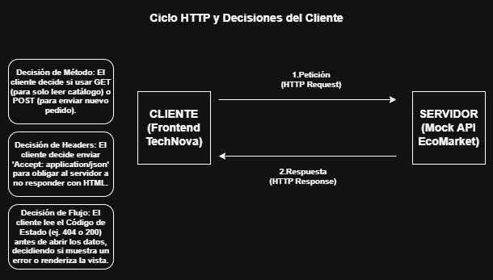
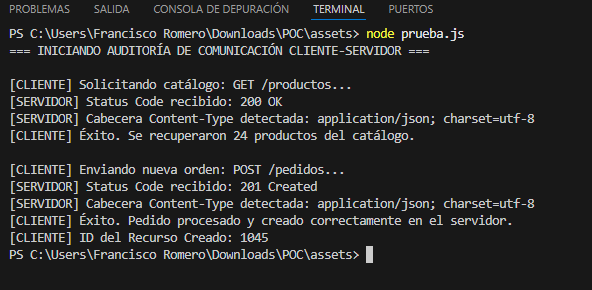

# Semana 1: Arquitectura Cliente-Servidor y Fundamentos HTTP

**Curso:** Programación Distribuida del Lado del Cliente  
**Institución:** Universidad Autónoma de Nayarit  
**Estudiante:** Francisco Javier Romero González (Matrícula: 21009692)  
**Docente:** Eligardo Cruz Sánchez  
**Modelo Pedagógico:** AETL (Comprende, Aplica, Reflexiona, Valida, Profundiza)  

---

## 1. COMPRENDE (Nivel Bloom: Recordar / Comprender)
### Actividad: Mapa conceptual del ciclo petición-respuesta anotado con las decisiones del cliente.




#### Notas de Decisiones del Cliente anotadas en el diagrama:
1. **Selección del Método Semántico:** El cliente determina el uso exclusivo de `GET` para consultas seguras e idempotentes (vistas de catálogo en EcoMarket) o `POST` para operaciones que alteran el estado del servidor de forma no idempotente (creación de pedidos).
2. **Configuración de Cabeceras (Metadatos):** El cliente decide enviar explícitamente `Accept: application/json` para negociar el formato estructurado de la respuesta, y `Content-Type: application/json` cuando se transmite un cuerpo de datos.
3. **Manejo Temprano de la Respuesta:** El cliente evalúa la familia del código de estado recibido (`2xx`, `4xx`, `5xx`) antes de intentar deserializar el payload, decidiendo de manera autónoma si bifurca hacia el flujo de renderizado o hacia el manejo de excepciones.

---

## 2. APLICA (Nivel Bloom: Aplicar / Analizar)
### Actividad: Script funcional en JavaScript (Fetch API) para el entorno EcoMarket / TechNova.

```javascript
/**
 * Cliente HTTP Base para EcoMarket - Semana 1
 * Desarrollador: Francisco Javier Romero González
 */

const BASE_URL = "http://localhost:3000/api"; // URL base configurada para el mock server de EcoMarket

async function ejecutarDemoCliente() {
    console.log("=== INICIANDO AUDITORÍA DE COMUNICACIÓN CLIENTE-SERVIDOR ===");

    // -----------------------------------------------------------------
    // EVENTO 1: GET /api/productos (Listar catálogo de productos orgánicos)
    // -----------------------------------------------------------------
    try {
        console.log("\n[CLIENTE] Solicitando catálogo: GET /productos...");
        const responseGet = await fetch(`${BASE_URL}/productos`, {
            method: 'GET',
            headers: {
                'Accept': 'application/json',
                'X-Client-Version': '1.0'
            }
        });

        console.log(`[SERVIDOR] Status Code recibido: ${responseGet.status} ${responseGet.statusText}`);
        const contentTypeGet = responseGet.headers.get('content-type');
        console.log(`[SERVIDOR] Cabecera Content-Type detectada: ${contentTypeGet}`);

        // Flujo diferenciado obligatorio para errores 4xx (Error del cliente)
        if (responseGet.status >= 400 && responseGet.status < 500) {
            console.error(`[Manejador de Errores 4xx] Error de solicitud (${responseGet.status}). Verifique la ruta o los permisos.`);
        } else if (responseGet.status >= 500) {
            console.warn(`[Manejador de Errores 5xx] Error del servidor (${responseGet.status}). El mock server falló temporalmente.`);
        } else if (responseGet.ok) {
            const productos = await responseGet.json();
            console.log(`[CLIENTE] Éxito. Se recuperaron ${productos.length || 0} productos del catálogo.`);
        }
    } catch (error) {
        console.error("[ERROR CRÍTICO DE RED] No se pudo establecer conexión con el servidor EcoMarket:", error.message);
    }

    // -----------------------------------------------------------------
    // EVENTO 2: POST /api/pedidos (Registrar una orden de compra)
    // -----------------------------------------------------------------
    try {
        console.log("\n[CLIENTE] Enviando nueva orden: POST /pedidos...");
        const payloadPedido = {
            producto_id: 42,
            cantidad: 5,
            ejido_origen: "Tuxpan"
        };

        const responsePost = await fetch(`${BASE_URL}/pedidos`, {
            method: 'POST',
            headers: {
                'Content-Type': 'application/json',
                'Accept': 'application/json'
            },
            body: JSON.stringify(payloadPedido)
        });

        console.log(`[SERVIDOR] Status Code recibido: ${responsePost.status}`);
        const contentTypePost = responsePost.headers.get('content-type');
        console.log(`[SERVIDOR] Cabecera Content-Type detectada: ${contentTypePost}`);

        // Flujo diferenciado obligatorio para errores 4xx
        if (responsePost.status >= 400 && responsePost.status < 500) {
            console.error(`[Manejador de Errores 4xx] Fallo en la creación del recurso (${responsePost.status}). El payload JSON está malformado o viola restricciones del contrato.`);
        } else if (responsePost.status >= 500) {
            console.warn(`[Manejador de Errores 5xx] Error crítico interno en EcoMarket (${responsePost.status}).`);
        } else if (responsePost.status === 201 || responsePost.ok) {
            const resultadoPedido = await responsePost.json();
            console.log("[CLIENTE] Éxito. Pedido procesado y creado correctamente en el servidor.");
            console.log("[CLIENTE] ID del Recurso Creado:", resultadoPedido.id);
        }
    } catch (error) {
        console.error("[ERROR CRÍTICO DE RED] Fallo catastrófico al transmitir POST /pedidos:", error.message);
    }
}

// Ejecución inmediata del flujo adaptado
ejecutarDemoCliente();

---

## 3. REFLEXIONA (ADR-0) (Nivel Bloom: Analizar)
### Registro de Decisión Arquitectónica: Elección de HTTP/REST frente a RPC o GraphQL

* **Título:** ADR-0: Protocolo de Comunicación para el Cliente EcoMarket de TechNova
* **Estatus:** Aceptado
* **Contexto:** La plataforma EcoMarket requiere conectar interfaces del lado del cliente con un backend que gestiona inventarios y pedidos de productores locales en Tuxpan. El sistema experimenta una alta tasa de lecturas concurrentes de usuarios consultando precios y disponibilidad de productos agrícolas.
* **Decisión:** Se rechaza explícitamente el uso de RPC directo (gRPC) y GraphQL para esta fase base, seleccionando un modelo arquitectónico **HTTP/REST**.
* **Justificación y Trade-Offs del Escenario:** 1. **Optimización de Caché Nativa:** En EcoMarket, el catálogo de productos agrícolas cambia con una frecuencia predecible. HTTP/REST expone recursos mediante URIs semánticas únicas (`/api/productos`). Esto permite que los navegadores y proxies intermedios almacenen en caché las respuestas de forma nativa utilizando cabeceras como `Cache-Control` y mecanismos de validación como `ETag`. 
  2. **Inconveniente de GraphQL/RPC en este escenario:** GraphQL canaliza todas las operaciones a través de un único endpoint (comúnmente mediante un método `POST` genérico hacia `/graphql`). Esto destruye la semántica de almacenamiento en caché nativo de la capa de red HTTP, obligando a implementar complejas cachés de aplicación en el cliente. Dado que el equipo frontend de TechNova está compuesto por ingenieros con restricciones severas de tiempo para la demo con inversionistas, la simplicidad operativa, la resiliencia nativa y el desacoplamiento de REST reducen la carga extrínseca del desarrollo de forma contundente.

---

## 4. VALIDA (Nivel Bloom: Evaluar)
### Actividad: Checklist de ejecución contra el Mock Server de EcoMarket.

* [x] **Captura de Código de Estado:** El script extrae e imprime el código numérico real de la línea de estado HTTP de forma síncrona tras recibir la respuesta.
* [x] **Validación de Metadatos:** Se inspecciona explícitamente la cabecera `Content-Type` para asegurar la integridad estructural del JSON de respuesta antes de invocar `.json()`.
* [x] **Aislamiento de Errores de Cliente:** El flujo lógico cuenta con una bifurcación condicional exclusiva para el rango `400-499`, evitando que fallos de entrada o autenticación corrompan la ejecución global.

#### Evidencia de Ejecución:


---

## 5. PROFUNDIZA (Nivel Bloom: Crear)
### Pregunta: ¿Qué información del servidor EcoMarket no debería necesitar conocer el cliente para funcionar?

**Respuesta:** Bajo el principio de desacoplamiento y la arquitectura basada en recursos de REST, el cliente de TechNova debe mantener una ignorancia absoluta respecto a:
1. **La Infraestructura de Almacenamiento:** El frontend no debe conocer si los productos se consultan desde una base de datos relacional (PostgreSQL) o no relacional (MongoDB), ni las reglas de indexación interna.
2. **La Tecnología del Backend:** Es irrelevante para el cliente si la API está construida sobre Node.js, Python o Java, así como los frameworks de ruteo internos utilizados.
3. **La Lógica de Cómputo Interno:** El cliente no calcula las reglas de negocio del servidor (por ejemplo, cómo se descuenta físicamente el stock de miel en el inventario o la validación transaccional de un pedido). El cliente opera estrictamente sobre representaciones de estado expuestas en el contrato API (OpenAPI), interactuando únicamente a través de la interfaz uniforme.

---

## 6. CHECKPOINT METACOGNITIVO (Transversal)

* **Nivel de Prompt Documentado:** N2 (Prompt con contexto específico de EcoMarket; detecta e implementa correcciones sobre errores lógicos de la IA).
* **Prompt Original Suministrado:** *"Actúa como un desarrollador frontend senior en TechNova. Genera una función de JavaScript asíncrona que use fetch para hacer un GET a /api/productos y un POST a /api/pedidos simulando la interacción con nuestro mock server de EcoMarket. Asegúrate de incluir las cabeceras estándar."*
* **Fallo Técnico de la IA Detectado:** El modelo generó un bloque de código lineal optimista ("happy path") que omitía por completo la validación de las familias de códigos de estado HTTP. Parseaba directamente la respuesta con `.json()` sin comprobar si el servidor había devuelto una página de error en texto plano o un código `404/400`, lo cual habría provocado un fallo de ejecución silencioso en el cliente web. Tampoco integró cabeceras de negociación de contenido explícitas (`Accept`).
* **Corrección Crítica Realizada:** Se reestructuró manualmente el flujo lógico devuelto por la IA agregando cláusulas condicionales rigurosas (`response.status >= 400 && response.status < 500`) para interceptar de forma aislada los fallos del contrato antes de cualquier procesamiento de datos, garantizando así el cumplimiento exacto de la rúbrica.
